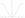
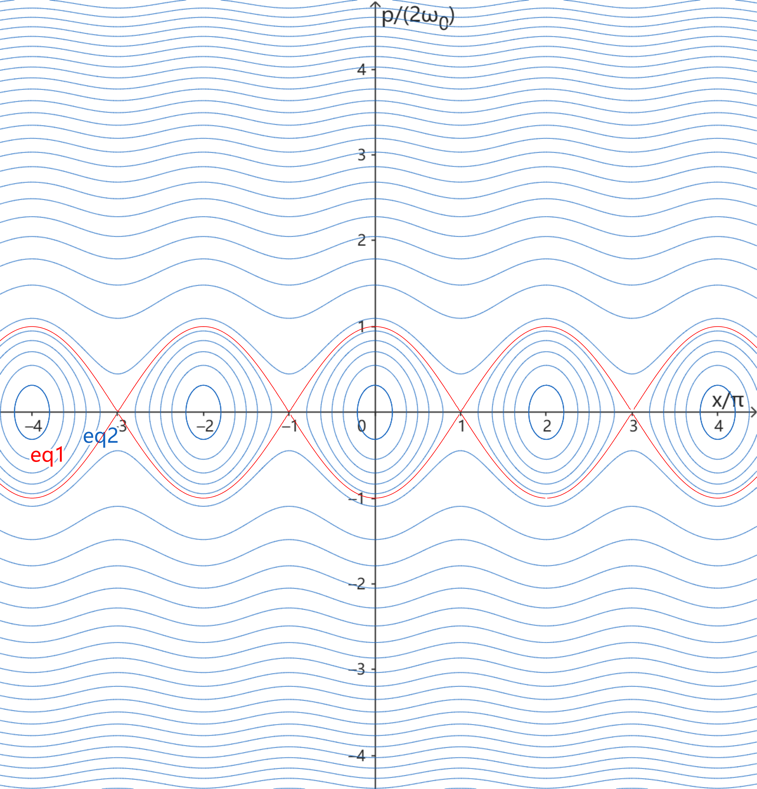

## Lagrangian
$$
L(x,\dot{x})=\frac{1}{2}\dot{x }^2-V(x) 
$$
where
$$
V(x)=\omega_0^2 \left(1-\cos{x} \right)
$$

### Symmetry

$$
x \rightarrow x +2\pi,\quad L\rightarrow L
$$

WLOG (without loss of generality), 

$$ x \in (-\pi-\delta,\pi+\delta) $$

### Stability
stable: 

$$ 
x = 0 + 2n\pi
$$   

unstable:

$$
x=\pi + 2n\pi
$$

$$(n\in \mathbb{Z})$$
## Hamitonian
$$
H(x,p)=\frac{p^2}{2}+V(x)
$$

Phase space 运动轨迹

$$
\frac{p^2}{2}+ \omega_0^2 \left(1-\cos{x} \right) = E 
$$

如下图 (红色线eq1 为 

$$ 
E= 2\omega_0^2
$$ 

)

